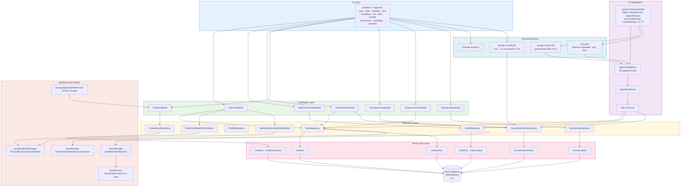
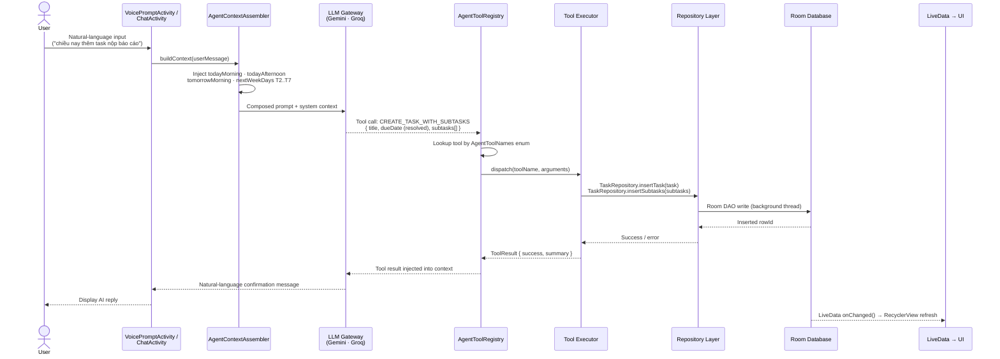

# 📝 TickTickToDo

> An AI-powered task management application for Android, developed at HCMUTE.

[](https://developer.android.com)
[](https://www.java.com)
[](https://developer.android.com/studio/releases/platforms)
[](https://developer.android.com/topic/architecture)
[](https://ai.google.dev)
[](https://developer.android.com/training/data-storage/room)
[](https://developer.android.com/topic/libraries/architecture/workmanager)
[](https://firebase.google.com)
[](LICENSE)

---

## 2. Abstract

TickTickToDo is an AI-augmented task management application for the Android platform, designed to address the productivity challenges faced by university students and professionals through intelligent scheduling, habit formation, and contextual task prioritization. The application integrates a large language model (LLM) agent — backed by Google Gemini or Groq — with a structured tool registry of twenty domain-specific operations, enabling natural-language task creation, bulk rescheduling, Eisenhower Matrix classification, and Pomodoro session management from a conversational interface. A purpose-built context assembler resolves Vietnamese relative temporal expressions (e.g., "chiều nay", "sáng thứ 2 tuần tới") into absolute timestamps before each LLM invocation, ensuring reliable date inference without fine-tuning. This project was developed as an academic software engineering exercise at Ho Chi Minh City University of Technology and Education (HCMUTE), applying the MVVM architectural pattern with a clean Repository data layer.

---

## 3. Table of Contents

1. [Title & Badges](#-tickticktodo)
2. [Abstract](#2-abstract)
3. [Table of Contents](#3-table-of-contents)
4. [Features](#4-features)
5. [System Architecture](#5-system-architecture)
   - 5.1 [Architectural Pattern](#51-architectural-pattern)
   - 5.2 [Repository Graph](#52-repository-graph)
   - 5.3 [AI Agent Architecture](#53-ai-agent-architecture)
   - 5.4 [Data Flow Diagram](#54-data-flow-diagram)
6. [Tech Stack](#6-tech-stack)
7. [AI Agent Tool Registry](#7-ai-agent-tool-registry)
8. [Module Structure](#8-module-structure)
9. [Getting Started](#9-getting-started)
   - 9.1 [Prerequisites](#91-prerequisites)
   - 9.2 [Build & Run](#92-build--run)
   - 9.3 [API Key Configuration](#93-api-key-configuration)
10. [Configuration](#10-configuration)
11. [Testing](#11-testing)
12. [Known Limitations & Future Work](#12-known-limitations--future-work)
13. [Contributing](#13-contributing)
14. [License](#14-license)
15. [Acknowledgements](#15-acknowledgements)

---

## 4. Features

### 🗂️ Core Task Management
- Create, edit, complete, and delete tasks with titles, descriptions, due dates, and priority levels
- **Subtask support** — decompose complex tasks into ordered step-by-step subtasks
- **TodoList grouping** — organise tasks into named lists with custom icons
- Bulk reschedule tasks via a single AI command
- Overdue task detection and smart reminders via `AiReminderPopupActivity`
- Quick-add from any screen using the **Floating Quick-Add bubble** (`FloatingQuickAddActivity`)
- **Eisenhower Matrix** view — classify tasks across Urgent/Important quadrants

### 🤖 AI Agent Capabilities
- Conversational chat interface backed by Google Gemini or Groq LLM
- **20-tool agent registry** — covers task CRUD, habit management, scheduling, and analytics
- **AgentContextAssembler** — injects real-time temporal context (today morning/afternoon, tomorrow, next-week days T2–T7) so the LLM correctly resolves Vietnamese relative time expressions without hallucination
- Multi-session **chat history** persisted in Room DB (`ChatHistoryRepository`)
- **Voice input** — `VoicePromptActivity` transcribes speech to task commands
- One-tap **model switching** between Gemini and Groq via chip group UI
- API key history (up to 10 keys) stored in `EncryptedSharedPreferences`
- **Floating AI assistant bubble** for ephemeral, context-aware nudges (no DB persistence)

### 🔥 Habit Tracking
- Create daily habits with optional icon assignment
- **Daily reminder alarms** per habit via `AlarmManager` (persisted across reboots via `BootReceiver`)
- Quick check-in directly from the system notification (`HabitCheckInActionReceiver`)
- **GitHub-style heatmap** visualisation of 84-day habit completion history
- Streak counter for consecutive completion days
- AI-generated motivational nudges when three consecutive days are missed (throttled per habit per day via `SharedPreferences`)
- Long-press habit chip to edit or cancel the daily reminder time

### 📅 Calendar & Moodle Integration
- Monthly grid calendar view with event overlay
- **Moodle / HCMUTE integration** — authenticate via `SchoolLoginActivity`, import academic deadlines as iCal (`.ics`) through `MoodleActivity`
- `SYNC_NEW_DEADLINES_TOOL` — the AI agent can autonomously pull new Moodle deadlines into the task list
- `CountdownEvent` model tracks time-critical academic events with live countdowns

### ⏱️ Productivity Tools
- **Pomodoro / Countdown timer** (`START_POMODORO_TOOL`) with session labels and lap recording
- **Propose Daily Plan** and **Propose Weekly Plan** tools — AI generates structured schedules
- **Apply Plan Option** — one-tap acceptance of AI-proposed plans into the task list
- **Breakdown Task** tool — AI decomposes a selected task into subtasks automatically
- **Statistics screen** (`StatisticsActivity`) — productivity analytics and activity log
- `ActivityLog` model records user actions for retrospective analytics

### 🎨 UX & Customisation
- **Theme selection** (`ThemeSelectionDialog`) — multiple Material3 colour themes
- **Language selection** (`LanguageSelectionDialog`) — multi-language UI support
- Material3 design system throughout — dynamic colour, edge-to-edge layout, `CoordinatorLayout`
- `ViewBinding` enabled across all screens for type-safe view access
- Firebase Analytics integration for usage telemetry

---

## 5. System Architecture

### 5.1 Architectural Pattern

TickTickToDo adheres to the **MVVM (Model-View-ViewModel)** architectural pattern recommended by the Android Jetpack guidelines, augmented by a **Repository Pattern** data layer. Each feature module owns a dedicated `ViewModel` that exposes `LiveData` streams to its corresponding `Activity` or `Fragment`; no direct database access occurs in the UI layer. Repositories mediate between ViewModels and Room DAOs, and additionally dispatch side-effects to `WorkManager`, `AlarmManager`, or `LocalBroadcastManager` where needed. The AI subsystem is decoupled from the standard MVVM stack: an `AgentContextAssembler` composes the prompt context, an `AgentToolRegistry` maps tool names to executor implementations, and each executor delegates persistence operations back through the existing Repository layer, preserving a single source of truth.

---

### 5.2 Repository Graph



The diagram above illustrates the complete dependency graph of TickTickToDo. The UI layer communicates exclusively with ViewModels, which in turn delegate persistence to typed Repositories; no layer skipping is permitted. The AI subsystem operates as a parallel concern — it reads context through `AgentContextAssembler` and writes state through the same Repository layer used by the rest of the application, ensuring consistency. External services (Gemini, Groq, Firebase, Moodle) are accessed only from the AI subsystem or specific feature repositories, keeping I/O boundaries explicit.

---

### 5.3 AI Agent Architecture



This sequence diagram traces the complete lifecycle of an AI-initiated task creation. The `AgentContextAssembler` enriches the raw user message with structured temporal anchors before the LLM ever sees it, which is the mechanism that allows the model to correctly interpret relative Vietnamese time expressions without additional fine-tuning. The tool-call result is fed back into the LLM context so the model can generate a coherent natural-language confirmation, while the Room `LiveData` pipeline simultaneously refreshes the UI independently of the chat thread.

---

### 5.4 Data Flow Diagram

```mermaid
graph LR
    subgraph Input["User Input"]
        V[VoicePromptActivity<br/>Speech-to-Text]
        C[ChatActivity<br/>Text Input]
    end

    subgraph Agent["AI Agent"]
        ACA[AgentContextAssembler<br/>Time context injection]
        LLM[LLM — Gemini / Groq]
        TOOL[CREATE_TASK_WITH_SUBTASKS<br/>Tool Executor]
    end

    subgraph Persistence["Persistence"]
        TR[TaskRepository]
        DAO1[TaskDao]
        DAO2[SubtaskDao]
        DB[(Room DB)]
    end

    subgraph Reactive["Reactive UI Update"]
        LD[LiveData&lt;List&lt;Task&gt;&gt;]
        VM[TaskViewModel]
        RV[RecyclerView / Task List UI]
    end

    V -->|transcribed text| ACA
    C -->|typed text| ACA
    ACA -->|enriched prompt| LLM
    LLM -->|tool call JSON| TOOL
    TOOL -->|Task + Subtask objects| TR
    TR -->|INSERT| DAO1 & DAO2
    DAO1 & DAO2 -->|write| DB
    DB -->|query subscription| LD
    LD -->|observe| VM
    VM -->|postValue| RV
```



This data flow diagram isolates the path from user input to UI render for the most common AI interaction — task creation. Voice and text inputs converge at the `AgentContextAssembler`, flow through the LLM as a structured tool call, and are persisted atomically via `TaskRepository`. The reactive `LiveData` subscription ensures the task list UI updates without any explicit refresh call from the AI layer, preserving a clean separation between the AI execution path and the presentation layer.

---

## 6. Tech Stack

| Layer | Technology | Version | Purpose |
|---|---|---|---|
| Language | Java | 11 (source/target compat) | Primary application language |
| Platform | Android SDK | compileSdk 35 / minSdk 26 | Target runtime environment |
| Architecture | MVVM + Repository | Jetpack standard | Separation of concerns |
| UI Toolkit | Material3 / AndroidX AppCompat | Latest stable | Component library & theming |
| View Binding | ViewBinding | (Gradle plugin) | Type-safe view access |
| Database | Room (SQLite) | Latest Jetpack | Local structured persistence |
| Reactive Streams | LiveData + ViewModel | AndroidX Lifecycle | Observable state management |
| Background Work | WorkManager | 2.9.0 | Reliable deferred background tasks |
| Alarms | AlarmManager | Android SDK | Exact habit reminder scheduling |
| AI SDK | Google Generative AI (Gemini) | 0.8.0 | On-device LLM integration |
| AI (alternative) | Groq API | OpenAI-compatible REST | Fast inference via `gsk_` keys |
| Navigation | Navigation Component | AndroidX | Fragment back-stack management |
| iCal Parsing | biweekly | 0.6.6 | Moodle `.ics` calendar import |
| Analytics | Firebase BOM | 34.12.0 | Usage telemetry |
| Secure Storage | security-crypto | 1.1.0-alpha06 | EncryptedSharedPreferences for API keys |
| Unit Testing | Mockito | 5.12.0 | Repository / ViewModel unit tests |
| UI Testing | Espresso | AndroidX test | Instrumented integration tests |

---

## 7. AI Agent Tool Registry

The `AgentToolNames` enumeration defines the complete contract between the LLM and the application's domain layer. All twenty tools are dispatched through `AgentToolRegistry` and executed on background threads via the Repository layer.

| # | Tool Name | Category | Description |
|---|---|---|---|
| 1 | `CREATE_TASK_WITH_SUBTASKS` | Task Management | Create a new task and optionally attach an ordered list of subtasks in a single atomic operation |
| 2 | `COMPLETE_TASK_TOOL` | Task Management | Mark a specified task as completed and trigger associated side-effects (notifications, activity log) |
| 3 | `RESCHEDULE_BULK_TASKS` | Task Management | Shift due dates for multiple tasks matching a filter criteria (e.g., all overdue tasks) |
| 4 | `GET_TODAY_TASKS` | Task Query | Retrieve all tasks due or scheduled for the current day, sorted by priority |
| 5 | `GET_OVERDUE_TASKS` | Task Query | Retrieve all tasks whose due date has passed and are not yet completed |
| 6 | `FIND_TASKS` | Task Query | Full-text search across task titles and descriptions matching a user-supplied keyword |
| 7 | `CREATE_MULTIPLE_TASKS` | Task Management | Batch-create several tasks in a single LLM tool call to reduce round-trips |
| 8 | `BREAKDOWN_TASK_TOOL` | Task Management | Decompose an existing parent task into AI-generated subtasks and persist them |
| 9 | `EISENHOWER_SORT_TOOL` | Prioritisation | Classify a set of tasks across the four Eisenhower quadrants (Urgent/Important matrix) |
| 10 | `START_POMODORO_TOOL` | Productivity | Launch a Pomodoro / countdown timer session associated with a selected task |
| 11 | `PROPOSE_DAILY_PLAN_TOOL` | Planning | Generate a structured, time-blocked plan for the current day based on pending tasks |
| 12 | `PROPOSE_WEEKLY_PLAN_TOOL` | Planning | Generate a structured week-view plan distributing tasks across the next seven days |
| 13 | `APPLY_PLAN_OPTION_TOOL` | Planning | Commit a specific AI-proposed plan option — creates/reschedules tasks accordingly |
| 14 | `GET_ALL_EVENTS_TOOL` | Calendar | Retrieve all countdown events and calendar entries visible to the AI agent |
| 15 | `SYNC_NEW_DEADLINES_TOOL` | Moodle Integration | Pull new academic deadlines from the authenticated Moodle/HCMUTE iCal feed and insert as tasks |
| 16 | `GET_HEALTH_SUMMARY_TOOL` | Analytics | Return a productivity health summary derived from the `ActivityLog` and habit streak data |
| 17 | `CREATE_HABIT` | Habit Tracking | Create a new habit with a name, icon, and optional daily reminder time |
| 18 | `LIST_HABITS` | Habit Tracking | Retrieve all habits with their current streak and last check-in date |
| 19 | `CHECKIN_HABIT` | Habit Tracking | Record a check-in for a specified habit for today's date |
| 20 | `GET_TODAY_TASKS` *(Groq variant)* | Task Query | Same semantics as `GET_TODAY_TASKS` but routed through the Groq OpenAI-compatible endpoint when the active API key begins with `gsk_` |

> **Note on Groq support:** Any API key beginning with `gsk_` is automatically routed to the Groq inference endpoint using the OpenAI-compatible API format. All twenty tools function identically regardless of which backend is active; model switching is exposed to the user as a one-tap chip group in the chat UI.

---

## 8. Module Structure

```
hcmute.edu.vn.tickticktodo/
│
├── model/                          # Domain entities (pure data classes)
│   ├── Task.java
│   ├── Subtask.java
│   ├── TodoList.java
│   ├── Habit.java
│   ├── HabitLog.java
│   ├── HabitHeatmapCell.java
│   ├── CountdownEvent.java
│   ├── CalendarDay.java
│   ├── ChatMessage.java
│   ├── ChatHistoryMessage.java
│   ├── ChatSession.java
│   ├── ActivityLog.java
│   └── IconItem.java
│
├── data/
│   ├── dao/                        # Room DAO interfaces (SQL queries)
│   │   ├── TaskDao.java
│   │   ├── SubtaskDao.java
│   │   ├── HabitDao.java
│   │   ├── HabitLogDao.java
│   │   ├── ChatDao.java
│   │   ├── ChatSessionDao.java
│   │   ├── CountdownEventDao.java
│   │   └── ActivityLogDao.java
│   ├── database/                   # Room database singleton & migrations
│   │   └── TaskDatabase.java       # DB v17 (migrated from v16)
│   └── repository/                 # Single source of truth per domain
│       ├── TaskRepository.java     # Core task CRUD + side-effect dispatch
│       ├── HabitRepository.java
│       ├── ProfileRepository.java
│       ├── ChatHistoryRepository.java
│       ├── CountdownEventRepository.java
│       ├── ActivityLogRepository.java
│       ├── TaskEventSideEffectPublisher.java
│       └── TaskNotificationSideEffectHelper.java
│
├── ui/                             # Feature-based screen modules
│   ├── task/                       # Task detail, Eisenhower, subtask views
│   ├── habit/                      # Habit tracker fragment + adapters
│   ├── calendar/                   # Month-grid calendar activity
│   ├── chat/                       # Conversational AI chat UI
│   ├── countdown/                  # Pomodoro / countdown timer
│   ├── list/                       # TodoList management
│   ├── main/                       # Home screen + navigation
│   ├── moodle/                     # Moodle login + iCal import
│   ├── assistant/                  # Floating assistant bubble
│   ├── activitylog/                # Productivity activity log
│   ├── eisenhower/                 # Eisenhower Matrix board
│   └── debug/                      # Internal debug screens (dev only)
│
├── ai/
│   ├── agent/                      # AI agent orchestration
│   │   ├── AgentContextAssembler.java   # Temporal context injection
│   │   ├── AgentToolRegistry.java       # Tool name → executor mapping
│   │   ├── AgentToolNames.java          # Enum of 20 tool identifiers
│   │   └── tools/                       # Individual tool implementations
│   └── llm/                        # LLM gateway abstraction (Gemini / Groq)
│
├── core/
│   ├── background/                 # WorkManager workers + FloatingAssistantService
│   │   └── TickTickWorkerBootstrapCoordinator.java
│   └── receivers/                  # BroadcastReceivers
│       ├── BootReceiver.java
│       ├── HabitReminderReceiver.java
│       └── HabitCheckInActionReceiver.java
│
└── helper/                         # Shared stateless utilities
    ├── GeminiManager.java
    ├── HabitAlarmManager.java
    ├── TickTickReceiverLifecycleHelper.java
    └── (other utility helpers)
```

| Package | Responsibility |
|---|---|
| `model/` | Plain Java domain entities annotated for Room; no Android framework dependencies |
| `data/dao/` | Room `@Dao` interfaces declaring SQL queries as annotated methods |
| `data/database/` | Room database singleton, schema version management, and migration scripts |
| `data/repository/` | Mediates between ViewModels and DAOs; dispatches background operations and side-effects |
| `ui/` | Feature-scoped Activities, Fragments, ViewModels, and RecyclerView Adapters |
| `ai/agent/` | LLM agent orchestration: context assembly, tool registry, and tool executor implementations |
| `ai/llm/` | Thin gateway abstraction over the Gemini SDK and Groq REST client |
| `core/background/` | WorkManager `Worker` subclasses and the foreground `FloatingAssistantService` |
| `core/receivers/` | `BroadcastReceiver` implementations for boot, habit alarms, and quick check-in actions |
| `helper/` | Stateless utility singletons shared across features (alarm scheduling, Gemini client, etc.) |

---

## 9. Getting Started

### 9.1 Prerequisites

| Requirement | Minimum Version |
|---|---|
| Android Studio | Hedgehog (2023.1.1) or newer |
| JDK | 11 |
| Android device or emulator | API level 26 (Android 8.0 Oreo) or higher |
| Google Gemini API key | From [Google AI Studio](https://aistudio.google.com) |
| Groq API key *(optional)* | From [console.groq.com](https://console.groq.com) — must begin with `gsk_` |

### 9.2 Build & Run

1. **Clone the repository**

```bash
git clone https://github.com/ducthinh4477/TickTickToDo.git
cd TickTickToDo
```

2. **Open in Android Studio**

   Select **File → Open** and navigate to the cloned directory. Allow Gradle to sync dependencies (this may take several minutes on first run as it resolves the Gemini SDK and Firebase BOM).

3. **Configure your API key** *(see [§ 9.3](#93-api-key-configuration) — no source code changes required)*

4. **Select a run target**

   Choose a connected device or AVD with API 26+. Then click **Run ▶** or execute:

```bash
./gradlew installDebug
```

5. **Verify the build**

```bash
./gradlew assembleDebug
```

   A successful build produces `app/build/outputs/apk/debug/app-debug.apk`.

### 9.3 API Key Configuration

TickTickToDo does **not** require API keys to be embedded in source code or `local.properties`. Keys are entered at runtime through the in-app Settings UI and stored securely using **`EncryptedSharedPreferences`** (backed by `androidx.security:security-crypto`), which wraps the Android Keystore for AES-256-GCM encryption at rest.

**Steps:**
1. Launch the application.
2. Open **Settings** (gear icon from the main screen).
3. Navigate to **AI Configuration** and tap **Add API Key**.
4. Paste your Gemini key (format: `AIza…`) or Groq key (format: `gsk_…`).
5. The application automatically detects the key prefix and routes requests to the appropriate backend.

The key history stores up to **10 previously used keys**, allowing quick switching between accounts without re-entry. Keys are never transmitted to any server other than the respective AI provider endpoint.

---

## 10. Configuration

### Theme Selection
Open **Settings → Appearance → Theme** to launch `ThemeSelectionDialog`. Multiple Material3 colour schemes are available and applied immediately without an app restart.

### Language Selection
Open **Settings → Language** to launch `LanguageSelectionDialog`. The application supports multiple UI languages; the `AgentContextAssembler` is aware of locale-specific temporal expressions and adjusts its Vietnamese time-phrase injection accordingly.

### Moodle / HCMUTE Integration
1. Open the **School** screen from the navigation drawer.
2. Authenticate via `SchoolLoginActivity` using your HCMUTE Moodle credentials.
3. `MoodleActivity` fetches the academic calendar as an iCal (`.ics`) stream, parsed by the **biweekly** library.
4. Imported deadlines appear as `CountdownEvent` entries and are visible to the AI agent via the `SYNC_NEW_DEADLINES_TOOL`.

---

## 11. Testing

### Unit Tests (Mockito)

Unit tests cover Repository and ViewModel logic using Mockito for dependency mocking.

```bash
./gradlew test
```

Test reports are generated at `app/build/reports/tests/testDebugUnitTest/index.html`.

### Instrumented Tests (Espresso)

Instrumented tests run on a connected device or emulator and verify UI interactions end-to-end.

```bash
./gradlew connectedAndroidTest
```

Results are available at `app/build/reports/androidTests/connected/index.html`.

### Continuous Verification

For iterative development, the following command assembles the debug variant and runs all unit tests in sequence:

```bash
./gradlew assembleDebug test
```

---

## 12. Known Limitations & Future Work

| Area | Current State | Planned Improvement |
|---|---|---|
| **ProGuard / R8** | Minification disabled in release build (`minifyEnabled false`) | Enable R8 with custom keep rules to reduce APK size and improve reverse-engineering resistance |
| **Internationalisation** | `MissingTranslation` lint warning suppressed; several strings exist only in Vietnamese | Complete English (and optionally other) translation files |
| **CI/CD** | No automated pipeline; builds and tests run locally only | Integrate GitHub Actions for per-PR build, lint, and test gating |
| **UseCase / Interactor layer** | Business logic resides in ViewModels, violating strict Clean Architecture | Extract `UseCase` classes between ViewModel and Repository to improve testability |
| **Debug package in production** | The `ui/debug/` package is compiled into release builds | Gate debug screens behind a `BuildConfig.DEBUG` flag and strip from release via Gradle product flavours |
| **Floating assistant persistence** | The floating AI bubble state is ephemeral (no DB persistence) | Optionally persist bubble conversation to `ChatHistoryRepository` |
| **Groq tool parity** | Groq routing currently coexists with Gemini SDK calls; full abstraction layer is incomplete | Unify behind a common `LlmGateway` interface with interchangeable backends |
| **DB migration testing** | Migration from schema v16 → v17 is untested in the automated test suite | Add `MigrationTestHelper` tests for all schema migrations |

---

## 13. Contributing

Contributions are welcome. Please follow the workflow below to maintain codebase consistency.

### Workflow

1. **Fork** the repository on GitHub.
2. **Create a feature branch** from `main`:

```bash
git checkout -b feat/your-feature-name
```

3. **Commit** using the [Conventional Commits](https://www.conventionalcommits.org/) format adopted throughout this project:

   | Prefix | When to use |
   |---|---|
   | `feat:` | A new user-facing feature |
   | `fix:` | A bug fix |
   | `refactor:` | Code restructuring with no behaviour change |
   | `test:` | Adding or updating tests |
   | `chore:` | Build scripts, dependency updates, tooling |
   | `docs:` | Documentation only changes |
   | `style:` | Code formatting, XML layout tweaks |

   Example:
   ```bash
   git commit -m "feat(habit): add streak milestone notification at 7-day mark"
   ```

4. **Push** your branch and **open a Pull Request** against `main`.
5. Ensure `./gradlew assembleDebug test` passes locally before requesting review.
6. Address review comments; squash fixup commits before merge if requested.

### Code Style
- Follow standard Android Java conventions (4-space indentation, camelCase members).
- All new `ViewModel` fields must be exposed as `LiveData`; no mutable `LiveData` leaked to UI.
- New AI tools must be registered in both `AgentToolNames` (enum entry) and `AgentToolRegistry` (executor binding).

---

## 14. License

```
MIT License

Copyright (c) 2024 HCMUTE — TickTickToDo Contributors

Permission is hereby granted, free of charge, to any person obtaining a copy
of this software and associated documentation files (the "Software"), to deal
in the Software without restriction, including without limitation the rights
to use, copy, modify, merge, publish, distribute, sublicense, and/or sell
copies of the Software, and to permit persons to whom the Software is
furnished to do so, subject to the following conditions:

The above copyright notice and this permission notice shall be included in all
copies or substantial portions of the Software.

THE SOFTWARE IS PROVIDED "AS IS", WITHOUT WARRANTY OF ANY KIND, EXPRESS OR
IMPLIED, INCLUDING BUT NOT LIMITED TO THE WARRANTIES OF MERCHANTABILITY,
FITNESS FOR A PARTICULAR PURPOSE AND NONINFRINGEMENT. IN NO EVENT SHALL THE
AUTHORS OR COPYRIGHT HOLDERS BE LIABLE FOR ANY CLAIM, DAMAGES OR OTHER
LIABILITY, WHETHER IN AN ACTION OF CONTRACT, TORT OR OTHERWISE, ARISING FROM,
OUT OF OR IN CONNECTION WITH THE SOFTWARE OR THE USE OR OTHER DEALINGS IN THE
SOFTWARE.
```

---

## 15. Acknowledgements

- **[HCMUTE — Trường Đại học Sư Phạm Kỹ Thuật TP.HCM](https://hcmute.edu.vn)** — Academic context and project supervision.
- **[Google Gemini AI](https://ai.google.dev)** — Large language model API powering the core AI agent.
- **[Groq](https://console.groq.com)** — Ultra-fast LLM inference endpoint for OpenAI-compatible tool calls.
- **[Firebase](https://firebase.google.com)** — Analytics and telemetry infrastructure.
- **[biweekly](https://github.com/mangstadt/biweekly)** — Open-source Java iCal/ICS parser used for Moodle academic calendar import.
- **[Android Jetpack](https://developer.android.com/jetpack)** — Room, LiveData, ViewModel, WorkManager, Navigation Component, and security-crypto libraries.
- **[Material Design 3](https://m3.material.io)** — Design system and component library.
- **[Mockito](https://site.mockito.org)** — Unit testing mock framework.

---

<div align="center">

Made with ☕ and 🤖 at HCMUTE · Ho Chi Minh City, Vietnam

[⬆ Back to top](#-tickticktodo)

</div>
